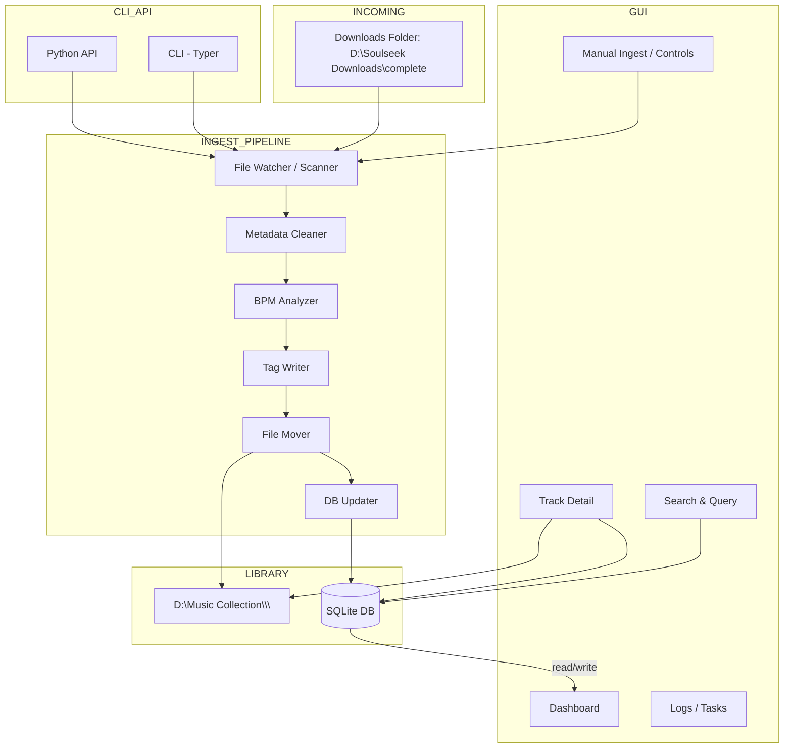

# Architecture

This document describes the architecture of the audio-files-tagging project.

## System Overview

The audio-files-tagging system is designed to organize, tag, and manage a personal music collection. It processes new downloads, analyzes metadata (including BPM), writes standardized tags, and maintains a searchable database.

## Architecture Diagram



## Component Descriptions

### Ingest Pipeline

The ingest pipeline is the core workflow for processing new music files:

1. **File Watcher / Scanner** (`aft.ingest`)
   - Detects new files in the downloads directory
   - Can run manually or on a schedule
   - Supports both full scans and incremental updates

2. **Metadata Cleaner** (`aft.tags`, `aft.utils.normalization`)
   - Normalizes filenames and directory names
   - Cleans and standardizes metadata tags
   - Handles various audio formats (MP3, FLAC, M4A, OGG)

3. **BPM Analyzer** (`aft.bpm`)
   - Uses librosa for beat tracking, with an additional octave-error
     correction pass (half/double-tempo) that scores tempo/2x/0.5x
     candidates against onset-envelope autocorrelation and picks the
     best-supported one within a configurable plausible range
     (default 60-200 BPM)
   - Confidence score reflects beat-strength consistency, not tempo
     correctness; low-confidence detections are still written but flagged
     for review (CLI `ingest` summary; GUI Query tab lets you correct a
     wrong value directly, writing straight to the file's tag)
   - A sanity bound (20-300 BPM) rejects implausible values before write

4. **Tag Writer** (`aft.tags`)
   - Unified interface for writing tags across formats
   - Supports ID3v2 (MP3), FLAC, MP4, and Vorbis tags
   - Handles BPM, genre, artist, album, and custom tags

5. **File Mover** (`aft.ingest`)
   - Organizes files into structured directories
   - Format: `<Artist>/<Album>/<Track>`
   - Handles filename conflicts and duplicates

6. **DB Updater** (`aft.db`)
   - Updates SQLite database with file metadata
   - Tracks file locations, BPM, tags, and modification times
   - Supports full scans and incremental updates

### Database Layer

**Technology**: SQLite with SQLAlchemy ORM

**Models** (`aft.db.models`):
- `Artist`: Artist information (name, country, profile, Discogs ID)
- `Release`: Album/release information (title, year, genre, label)
- `Track`: Individual track information (title, artist, album, BPM, duration, file path, tags)

**Operations** (`aft.db.database`):
- `init_db()`: Initialize database schema
- `scan_library()`: Full library scan
- `incremental_update()`: Detect and process new/modified files
- `query()`: Flexible querying by artist, album, BPM range, year, text search

### User Interfaces

#### CLI (Command-Line Interface)

Built with **Typer** for type-safe CLI applications.

**Scripts**:
- `aft.scripts.scan_library`: Scan library and update database
- `aft.scripts.ingest`: Process new downloads

**Example Usage**:
```bash
# Full library scan
python -m aft.scripts.scan_library scan "D:\Music Collection" --init

# Ingest new files
python -m aft.scripts.ingest ingest --source "D:\Soulseek Downloads\complete" --dest "D:\Music Collection"

# Analyze single file BPM
python -m aft.scripts.ingest analyze-bpm "track.mp3"
```

#### GUI (Graphical User Interface)

Built with **PySide6** (Qt for Python) for native desktop experience.

**Features** (`aft.gui.main`), four independent tabs (no shared state between them):
- **Dashboard**: Library statistics, recent activity
- **Discogs Lookup**: Search Discogs, review/edit metadata (genre+styles combined into one editable field), apply to loaded files
- **Query**: Search by artist, album, BPM range; edit a track's BPM cell directly to correct a wrong detection
- **Ingest**: Configure and run ingest operations, with real-time logging and progress bars (does not perform Discogs lookups - use the Discogs Lookup tab or CLI `--use-discogs` for that)

**Launch**:
```bash
python -m aft.gui.main --db "data/library.db"
```

#### Python API

All functionality is accessible programmatically:

```python
from aft.bpm import analyze_and_tag_bpm
from aft.ingest import process_directory
from aft.db import query, scan_library

# Analyze BPM
result = analyze_and_tag_bpm("track.mp3")

# Process directory
report = process_directory(
    source_dir=r"D:\Soulseek Downloads\complete",
    dest_root=r"D:\Music Collection",
    db_path="data/library.db"
)

# Query database
tracks = query(artist="Daft Punk", bpm_range=(120, 130))
```

### External Integrations

#### Discogs API (`aft.discogs_client`)

Optional integration for enhanced metadata:
- Artist information lookup
- Release details (label, catalog number, genres, styles)
- Track listings and metadata
- Requires a `DISCOGS_USER_TOKEN` env var (`.env` file, loaded via `aft.credentials`)

Wired into `aft.ingest.process_audio_file`/`process_directory` via the `discogs_client` parameter (CLI: `--use-discogs`): applies the top search match for the detected artist/album through `aft.tags.write_audio_tags`, with no human review step. The GUI's Discogs Lookup tab is the human-reviewed alternative and is unaffected by this wiring (the GUI's Ingest tab doesn't pass a `discogs_client`).

## Data Flow

### Typical Ingest Workflow

1. User drops files into `D:\Soulseek Downloads\complete`
2. User runs ingest (via CLI or GUI)
3. System scans for audio files
4. For each file:
   - Extract existing tags
   - Detect artist/album from directory structure or tags
   - Analyze BPM (if enabled)
   - Write cleaned tags
   - Move to `D:\Music Collection\<Artist>\<Album>\<Track>`
   - Update database record
5. Generate report with statistics and errors

### Database Sync Workflow

1. User runs library scan
2. System recursively finds all audio files
3. For each file:
   - Read metadata and audio properties
   - Check if file exists in database
   - Add new or update existing record
4. Database reflects current library state

## Technology Stack

- **Language**: Python 3.12+
- **Package management**: uv
- **Audio Processing**: librosa, mutagen
- **Database**: SQLite + SQLAlchemy
- **CLI**: Typer
- **GUI**: PySide6 (Qt for Python)
- **Testing**: pytest
- **Code Quality**: black, ruff, mypy

## Deployment

### Development Setup

```bash
# Install dependencies
uv sync

# Initialize database
uv run python -m aft.scripts.scan_library scan "D:\Music Collection" --init

# Run tests
uv run pytest tests/ -v
```

### Packaging (Future)

The application can be packaged as a standalone executable using:
- **PyInstaller**: Single-file Windows executable
- **Nuitka**: Compiled Python for better performance

## Design Decisions

### Why SQLite?
- **Portability**: Single-file database, easy backup
- **No server**: Runs locally without setup
- **Performance**: Fast for read-heavy workloads
- **SQLAlchemy**: Can migrate to MySQL/PostgreSQL if needed

### Why librosa for BPM?
- **Accuracy**: Robust beat tracking algorithm
- **Tempo Range**: Handles 60-200+ BPM
- **Active Development**: Well-maintained library
- **Alternatives**: essentia (more accurate but harder to install), aubio (faster but less accurate)

### Why PySide6 for GUI?
- **Native**: Desktop application with direct file access
- **Cross-platform**: Works on Windows, macOS, Linux
- **Python Integration**: No separate frontend build needed
- **Packaging**: Can be bundled into standalone .exe

### Why Typer for CLI?
- **Type Safety**: Automatic validation from type hints
- **Documentation**: Auto-generated help text
- **Modern**: Clean, intuitive syntax
- **Testing**: Easy to test CLI commands

## Future Enhancements

- **Key Detection**: Add musical key analysis (librosa or essentia)
- **Duplicate Detection**: Find and merge duplicate tracks
- **Playlist Management**: Create and manage playlists
- **Web Interface**: Optional FastAPI backend + React frontend for remote access
- **Watch Mode**: Automatic ingest when new files are detected
- **Batch BPM Analysis**: Background worker for analyzing entire library
- **Cover Art Management**: Download and embed album art
- **Integration with Music Players**: Export to iTunes, Rekordbox, etc.

## Contributing

See the main README for development guidelines and contribution instructions.
